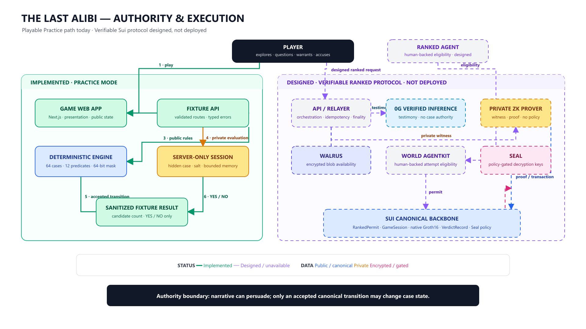

# The Last Alibi

> Every suspect can lie. The truth cannot.

**The Last Alibi** is a cinematic, privacy-preserving AI detective game where characters can improvise, persuade, and deceive—but they cannot rewrite the truth.

Players investigate a murder inside a private museum, interrogate autonomous suspects, collect evidence, request certified warrants, and commit one final accusation. Beneath the mystery, Sui, zero-knowledge proofs, 0G, Walrus, Seal, and World AgentKit establish a clean boundary between **narrative intelligence** and **canonical truth**.

## The mystery

During an invitation-only exhibition, the museum curator is killed as a security blackout fractures the timeline.

Four suspects were present:

- **Ada Vale** — the museum conservator;
- **Marcus Reed** — the head of security;
- **Celeste Moreau** — the exhibition patron;
- **Theo Lin** — the investigative journalist.

The hidden case is one combination of:

- 4 suspects;
- 4 rooms;
- 2 weapons;
- 2 time windows;
- **64 possible realities**.

The player explores the Grand Gallery, Restoration Lab, Archive Vault, and Rooftop Conservatory, comparing public evidence with expressive AI testimony. Every conversation can influence the detective. None of those conversations can alter the committed solution.

## The player experience

1. **Enter the museum.** Experience a cinematic opening and receive the case briefing.
2. **Explore four rooms.** Inspect public observations, environmental clues, and character behavior.
3. **Interrogate autonomous suspects.** Ask natural-language questions and evaluate responses that may be helpful, evasive, or misleading.
4. **Build a notebook.** Separate observations, testimony, certified evidence, and personal hypotheses.
5. **Request certified warrants.** Spend a limited query budget on registered binary predicates.
6. **Narrow the candidate universe.** Follow proof-backed YES/NO branches without exposing the hidden case.
7. **Commit one accusation.** Select the suspect, room, weapon, and time.
8. **Receive a private verdict.** Learn only whether the accusation is correct: **YES** or **NO**.

The intended result feels like a detective game first. Cryptography remains behind the curtain until the player asks to inspect a technical receipt.

## Three guarantees

### 1. AI cannot rewrite the truth

Suspect dialogue is narrative, not authority. A language model may persuade the player, but it cannot change the case commitment, candidate set, warrant history, or verdict.

### 2. The detective cannot extract unlimited hidden information

Certified warrants are selected from a registered predicate manifest. Before any private evaluation occurs, the protocol checks that both possible branches preserve at least two candidates. Warrants are nonce-bound, replay-protected, and capped at five disclosures.

### 3. The ending cannot change after commitment

The hidden case is committed before the investigation. The terminal proof binds the accusation and binary verdict back to that same committed case without revealing the losing solution.

## Authority and execution



The architecture follows one rule:

> Narrative can persuade; only an accepted canonical transition may change case state.

| System                | Intended authority                                                                    | What it can never decide                    |
| --------------------- | ------------------------------------------------------------------------------------- | ------------------------------------------- |
| **Game UI**           | Presentation, exploration, notebook, and player choices                               | Case truth or proof validity                |
| **API / relayer**     | Orchestration, idempotency, signing, and finality                                     | Which accusation is correct                 |
| **Sui Move**          | Canonical sessions, warrants, proof acceptance, replay protection, and terminal state | Natural-language testimony                  |
| **Private ZK prover** | Witness processing and Groth16 proof generation                                       | Policy, eligibility, or state authorization |
| **0G**                | Private and verifiable suspect inference                                              | Canonical evidence or verdict state         |
| **Walrus**            | Encrypted artifact availability                                                       | Plaintext truth or access rights            |
| **Seal**              | Decryption under Sui-defined policy                                                   | Verdict correctness                         |
| **World AgentKit**    | Human-backed Ranked Agent eligibility                                                 | Case outcome                                |

## How the protocol works

### Session creation

The trusted game boundary selects one case from the fixed 64-case universe and derives its canonical commitment. Private case material and salts remain server-side. The intended live flow creates a canonical Sui `GameSession` and binds encrypted terminal artifacts to that session.

### Verifiable suspect testimony

Suspect dialogue is routed through 0G Compute. The prompt contains only the selected suspect's permitted persona context, public room state, collected evidence, and bounded conversation history. A response is rendered only after the configured verification boundary succeeds.

0G has no case authority. Testimony can guide the detective, but it cannot eliminate candidates or alter a verdict.

### Certified warrants

A warrant selects one registered typed predicate such as:

- “Was the culprit Ada Vale?”
- “Did the murder occur in the Grand Gallery?”
- “Was the Ceremonial Dagger used?”
- “Did it happen before the blackout?”

The public candidate mask is partitioned into YES and NO branches before the secret is read:

```text
YES survivors = current mask ∩ predicate YES mask
NO survivors  = current mask ∩ predicate NO mask
```

The warrant is authorized only when both branches retain at least two candidates. A private Groth16 proof then binds the result to the exact session, level, case commitment, predicate, query nonce, and result bit. Sui verifies the proof natively before updating canonical state.

### Private accusation and verdict

The player's accusation remains inside the trusted boundary. A verdict proof establishes whether it matches the committed case and binds the binary result to the terminal attempt nonce.

The designed release sequence is:

1. generate and verify the verdict proof;
2. confirm the terminal transition on Sui;
3. retrieve the matching encrypted capsule from Walrus;
4. evaluate the Sui-defined Seal policy;
5. decrypt only for the authorized terminal session;
6. return only **YES** or **NO**.

The hidden case, private accusation opening, witness, and verdict plaintext are never public receipts.

## Partner integrations

### Sui — canonical truth

Sui objects map naturally to investigations, pending warrants, proof receipts, replay protection, one-time permits, and terminal records. Move independently enforces query limits, registered predicates, candidate-mask transitions, nonces, and post-terminal immutability.

The package uses native BN254 Groth16 verification with pinned query and verdict verifying keys.

### 0G — autonomous suspects

0G provides private, verifiable inference for interactive suspect dialogue. Provider identity, model metadata, request authentication, response identity, and verification status are checked before testimony can reach the player.

### Walrus — encrypted evidence availability

Walrus stores the exact Seal ciphertext—not the hidden case or plaintext verdict. The client computes the content Blob ID locally, verifies the publisher result, confirms certification, retrieves the blob, and checks byte-for-byte integrity.

### Seal — terminal disclosure

Seal binds encrypted verdict material to the Sui session, attempt nonce, protocol version, level version, accusation commitment, and verdict commitment. Decryption is possible only when the Sui policy recognizes the correct player and terminal session state.

### World AgentKit — accountable ranked play

World AgentKit distinguishes ordinary Practice sessions from human-backed Ranked Agent attempts. Authorization is resource-bound, level-bound, recipient-bound, expiring, nonce-protected, and consumable once. The raw human identifier is never published onchain.

## Verifiable Sui testnet evidence

The protocol has an inspectable Sui testnet acceptance path covering package publication, immutable level creation, canonical session creation, safe query authorization, genuine proof generation, native Groth16 verification, canonical state mutation, and replay rejection.

| Artifact                 | Identifier                                                           |
| ------------------------ | -------------------------------------------------------------------- |
| Package                  | `0x3e2aa9c08186046a6653326bcf46e0c4454f643dc132aef229001d739194d3ea` |
| Immutable level          | `0x1198846e70f62c06eaeee181f16bd641d752111306b19ddc62b368826e266818` |
| Accepted session         | `0xb93f874b84c8f292653f22b95edfce4e597e2b41d6bdeb13e953db593d866131` |
| Native proof transaction | `CFJgdKZZYyWuLiCLQ477DqCyZ9UY73gVbofeVZMBeFYT`                       |

- [Published Sui package](https://suiscan.xyz/testnet/object/0x3e2aa9c08186046a6653326bcf46e0c4454f643dc132aef229001d739194d3ea)
- [Immutable level configuration](https://suiscan.xyz/testnet/object/0x1198846e70f62c06eaeee181f16bd641d752111306b19ddc62b368826e266818)
- [Native Groth16 proof acceptance](https://suiscan.xyz/testnet/tx/CFJgdKZZYyWuLiCLQ477DqCyZ9UY73gVbofeVZMBeFYT)
- [Complete sanitized Gate 3A evidence](docs/evidence/GATE3A_SUI_TESTNET_2026-07-26.md)

### Cryptographic trust statement

The query and verdict parameters are a **hackathon/testnet single-party trusted setup. Non-production.** No multiparty ceremony occurred. Production use requires an appropriate ceremony or independently accepted production parameters.

## Ranked Agent mode

Ranked Agent mode is designed as a scarce, accountable attempt rather than an unrestricted bot endpoint.

1. The agent signs a resource- and level-bound authorization message.
2. World AgentKit validates the signature and confirms human backing through AgentBook.
3. Replay and one-human-per-level entitlement rules are consumed atomically.
4. A scoped permit binds the level, Sui recipient, resource, expiration, and nonce.
5. Sui consumes the permit once before ranked gameplay begins.

Human identity establishes eligibility—not truth. Sui and the proof system remain responsible for canonical game state.

## Privacy model

The browser may receive:

- public room observations;
- non-canonical suspect testimony;
- candidate counts and public masks;
- sanitized transaction and provider receipts;
- the final binary verdict.

The browser never needs:

- hidden case fields or salts;
- private witnesses or raw proofs;
- signer keys or provider credentials;
- private accusation openings;
- plaintext verdict capsules;
- raw World human identifiers.

## Technology

- **Frontend:** Next.js App Router, React, TypeScript
- **Game engine:** deterministic 64-case universe and registered predicate masks
- **Canonical execution:** Sui Move 2024 and the official Sui TypeScript SDK
- **Zero knowledge:** Groth16, Circom-compatible artifacts, and an arkworks Rust application prover
- **Inference:** 0G Compute
- **Encrypted storage:** Walrus
- **Policy-controlled disclosure:** Seal
- **Ranked authorization:** World AgentKit and AgentBook
- **Validation:** Vitest, Testing Library, Zod, ESLint, Prettier, Move tests, and cross-language vectors

## Repository map

| Path                      | Responsibility                                                             |
| ------------------------- | -------------------------------------------------------------------------- |
| `apps/web`                | Cinematic game, API routes, runtime status, and technical receipts         |
| `packages/game-engine`    | Case universe, predicates, candidate masks, and transitions                |
| `packages/protocol`       | Shared schemas, constants, and manifests                                   |
| `packages/sui`            | Transactions, execution, prover wrapper, Walrus, Seal, and verdict release |
| `packages/zero-g`         | Verified inference and private prompt boundaries                           |
| `packages/world-agentkit` | Human-backed authorization and ranked permits                              |
| `circuits/verdict`        | Query and verdict circuits, prover, vectors, and testnet parameters        |
| `contracts/alibi`         | Canonical Sui state machine and native proof verification                  |
| `contracts/ranked_permit` | One-time level-bound ranked authorization                                  |
| `docs/evidence`           | Sanitized testnet acceptance records                                       |

## Run the game

Requirements:

- Node.js `>=22.13.1 <23`
- pnpm `9.15.4`

```powershell
corepack enable
corepack pnpm install --frozen-lockfile
corepack pnpm dev
```

Open `http://localhost:3000` and choose **Begin Investigation**.

Production Practice build:

```powershell
$env:ALIBI_RUNTIME_MODE = 'fixture'
$env:ALIBI_FIXTURE_STORE_PATH = 'C:\tmp\last-alibi-sessions.json'
corepack pnpm build
corepack pnpm --filter @alibi/web exec next start --port 3100
```

## Explore the implementation

- [Native Sui Groth16 verification](contracts/alibi/sources/verifier.move)
- [Sui transaction submission and finality](packages/sui/src/server/execution.ts)
- [Verified 0G inference](packages/zero-g/src/adapter.ts)
- [Walrus ciphertext lifecycle](packages/sui/src/walrus-verdict.ts)
- [Seal encryption and policy release](packages/sui/src/seal-verdict.ts)
- [World AgentKit authorization](packages/world-agentkit/src/authorization.ts)
- [Trust boundaries](docs/architecture/TRUST_BOUNDARIES.md)

## Build disclosure

The repository includes a complete fixture-backed Practice Investigation and separately inspectable Sui testnet proof evidence. Full browser orchestration across every live partner boundary remains the next integration stage; the architecture above describes the intended complete experience.

---

**The Last Alibi** asks a simple question for the age of autonomous characters:

> If an AI can say anything, what guarantees that the ending is still true?
