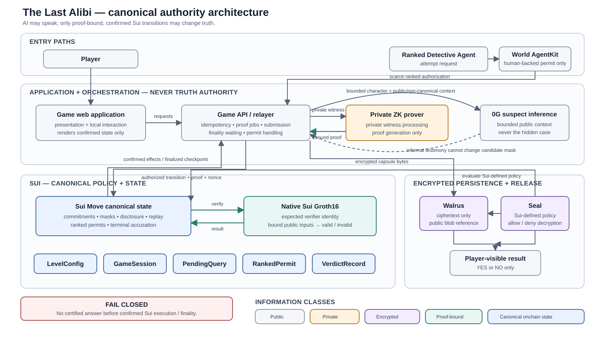

# The Last Alibi

> Every suspect can lie. The truth cannot.

The Last Alibi is a browser-based AI detective game for ETHGlobal Lisbon 2026. Suspects can improvise and misdirect, while commitments, disclosure rules, proof acceptance, and the final verdict remain outside the language model's control.

## Three guarantees

1. **AI cannot rewrite the truth.** Suspect inference is non-canonical; Sui case commitments and verified transitions define the canonical record.
2. **The detective cannot extract unlimited hidden information.** Certified binary warrants are registered, replay-protected, safety-checked, and capped.
3. **The publisher cannot change the ending after committing it.** The terminal proof and verdict commitment bind the released binary result to the original case.

## Gameplay loop

1. Explore a case and question AI-driven suspects.
2. Use a limited certified warrant to ask a registered `YES`/`NO` question.
3. Follow the confirmed candidate count without exposing the hidden case.
4. Commit a final suspect, room, weapon, and time accusation.
5. Receive only the commitment-checked terminal answer: `YES` or `NO`.

## Canonical architecture

Editable architecture and trust material:

- [System diagram source](docs/architecture/alibi-system.mmd)
- [Certified-warrant sequence](docs/architecture/certified-warrant-sequence.svg)
- [Accusation and verdict sequence](docs/architecture/verdict-release-sequence.svg)
- [Trust boundaries](docs/architecture/TRUST_BOUNDARIES.md)

## Authority at a glance

| Component | Intended authority | Explicit boundary |
|---|---|---|
| Sui Move | Canonical game state, disclosure policy, proof acceptance, replay protection, ranked permits, terminal verdict record | Does not receive model authority or plaintext private witnesses |
| ZK prover | Private witness processing and proof generation | Cannot set policy, state, eligibility, or verdict |
| 0G | Planned verified suspect-agent inference | Never receives the hidden case and cannot eliminate candidates |
| Walrus | Planned encrypted artifact persistence | Stores ciphertext; does not authorize access or establish truth |
| Seal | Planned decryption under Sui-defined policy | Does not prove plaintext truthfulness |
| World AgentKit | Planned human-backed authorization for a scarce Ranked Agent attempt | Cannot determine the game outcome |
| Game API / relayer | Orchestration, idempotency, proof jobs, finality waiting, permit handling | Cannot choose the case or verdict |
| Web application | Presentation and local interaction | Cannot establish case truth or proof validity |

## Target partner tracks

The planned architecture targets Sui, 0G, World AgentKit, Walrus, Seal, and zero-knowledge proof integrations. These are intended roles, not claims of completed or live partner integrations.

## Current status

Checkpoint D1 establishes the canonical architecture package:

- editable Mermaid sources and accessible SVG exports;
- explicit certified-warrant and terminal-verdict sequences;
- a component authority matrix, data classifications, fail-closed rules, and threat assumptions;
- pinned local sui-pilot documentation and Codex development tooling.

No Alibi application scaffold, Move contract, circuit, deployment, package address, live partner integration, or production proof setup exists yet.

## Product work and reused tooling

The architecture, game rules, trust model, and future Alibi implementation are new product work. The ignored local sui-pilot checkout and adapted Codex skills are third-party development infrastructure and are not part of the project's originality claim. See [Third-Party Components](docs/THIRD_PARTY_COMPONENTS.md).

## Immediate roadmap

1. **B1 ? Repository baseline:** choose and document the application, contract, circuit, and service workspace boundaries.
2. Define versioned protocol identifiers, typed predicates, commitment encodings, and proof public inputs.
3. Scaffold the smallest testable Sui Move package and circuit only after the baseline is approved.
4. Build fail-closed API and browser slices against local tests before introducing live partner integrations.
5. Revalidate these diagrams against deployed reality before submission.
